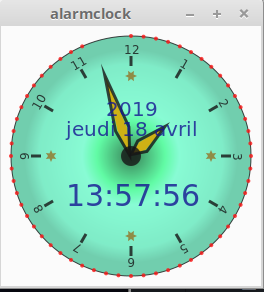

# jAnalogAlarmClock
analogic alarm clock Julia/Gtk/Luxor    

unfortunatly binary is very very big and start time soooo long compared to the [Racket one](https://github.com/nodrygo/RktAlarmClock)

alarm not yet done
